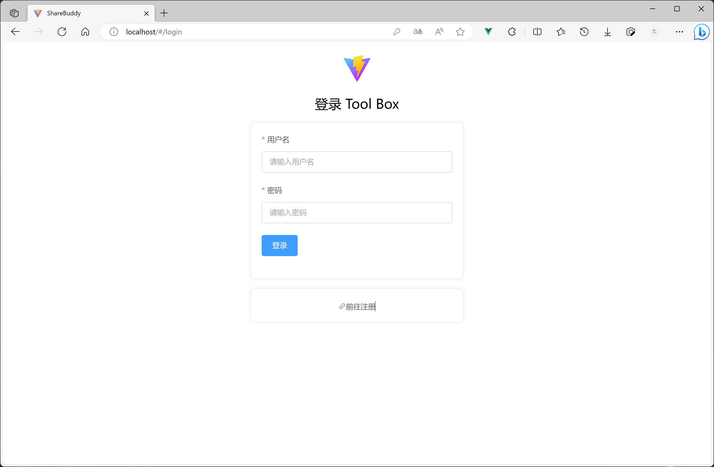
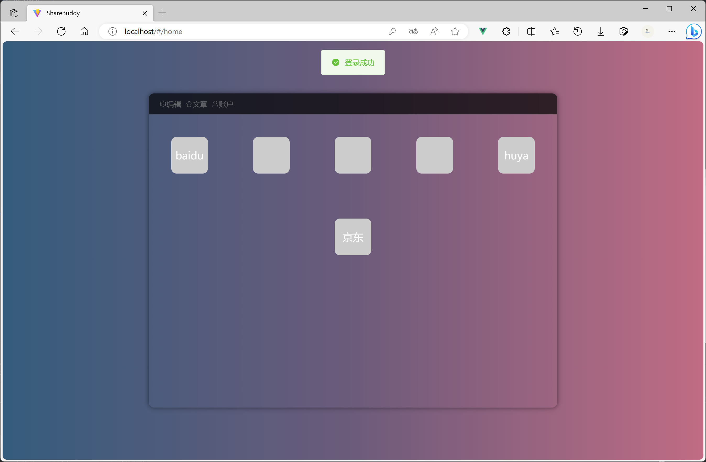
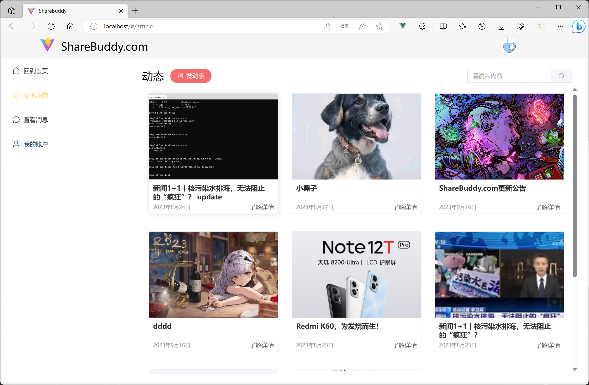
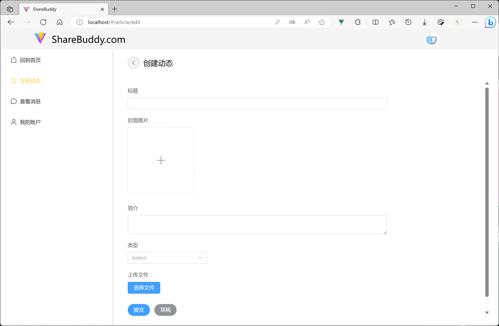
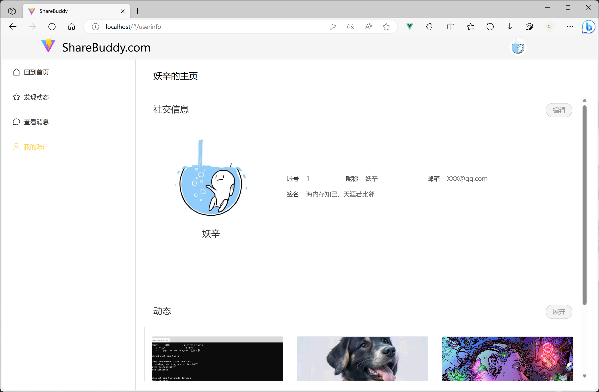

# tool box前端文档

## 效果展示

### 桌面端

#### 登录

#### 首页

#### 发现动态

#### 创建动态

#### 个人中心

### 手机端
懒得截图了和电脑端差不多，有响应式

## 使用说明

- 服务器请求地址在`src/api/request.js`中修改`baseURL`即可

- 后端服务器解决跨域，若依旧出现问题请参考后端文档

- 启动前端项目`npm run dev`